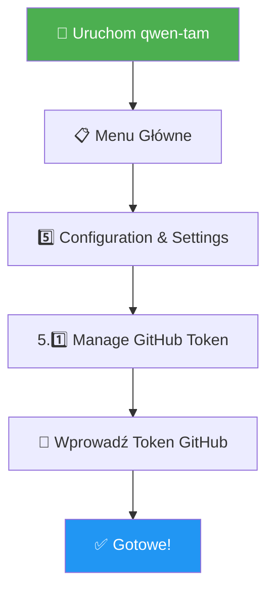
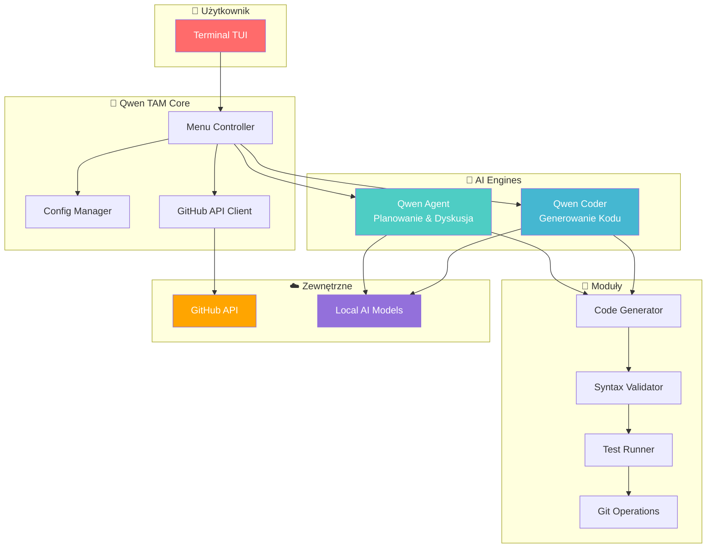
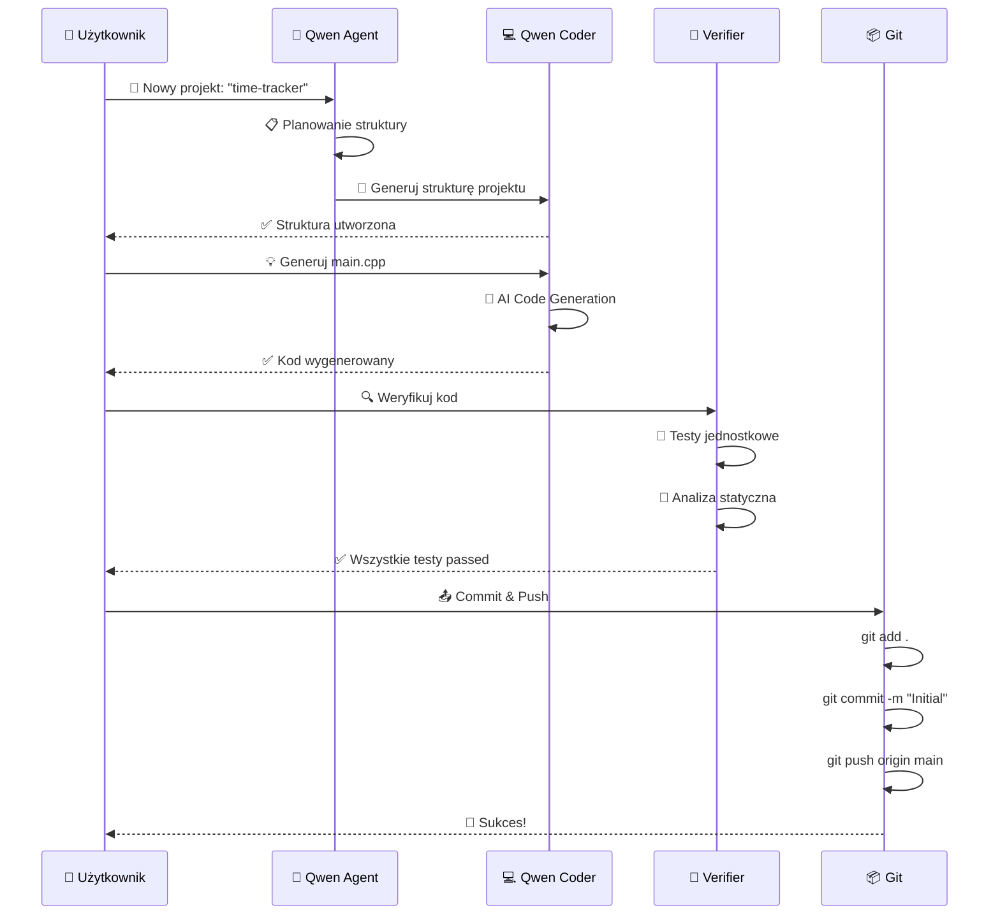
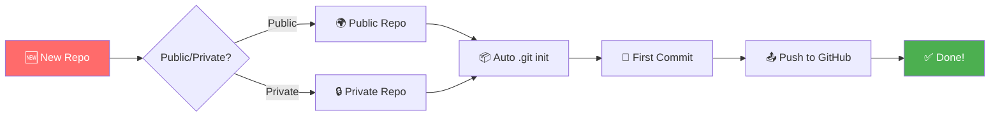
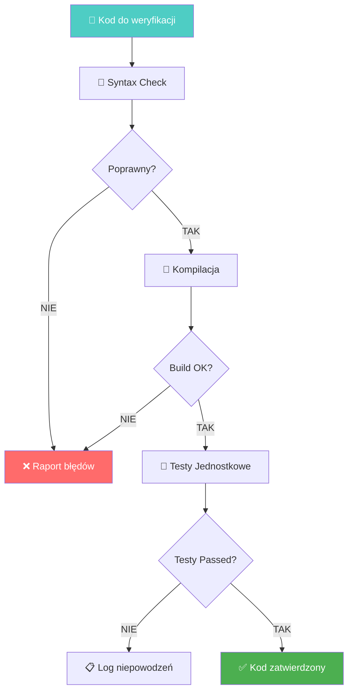
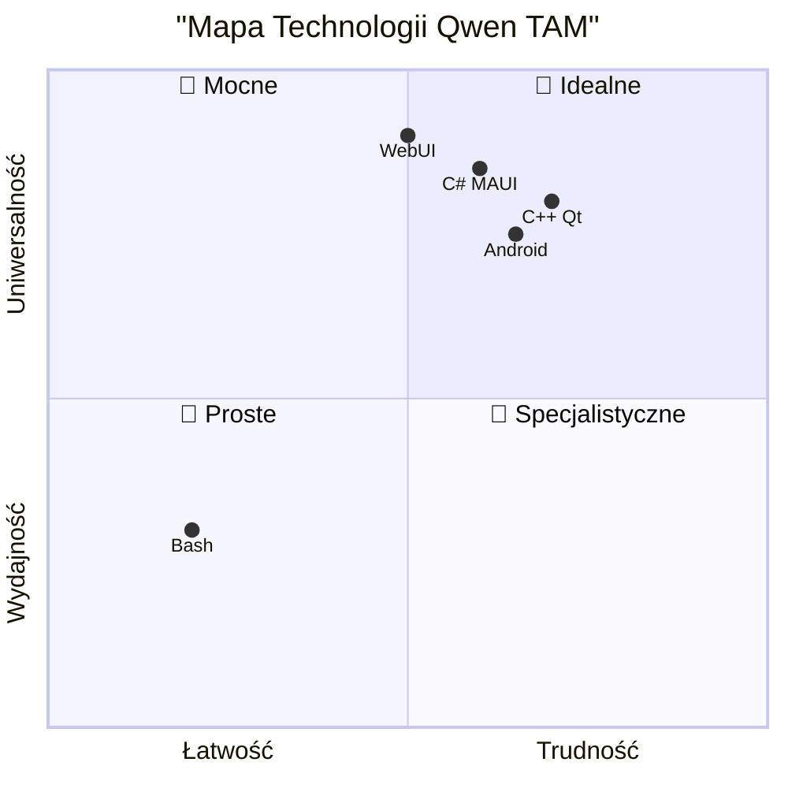
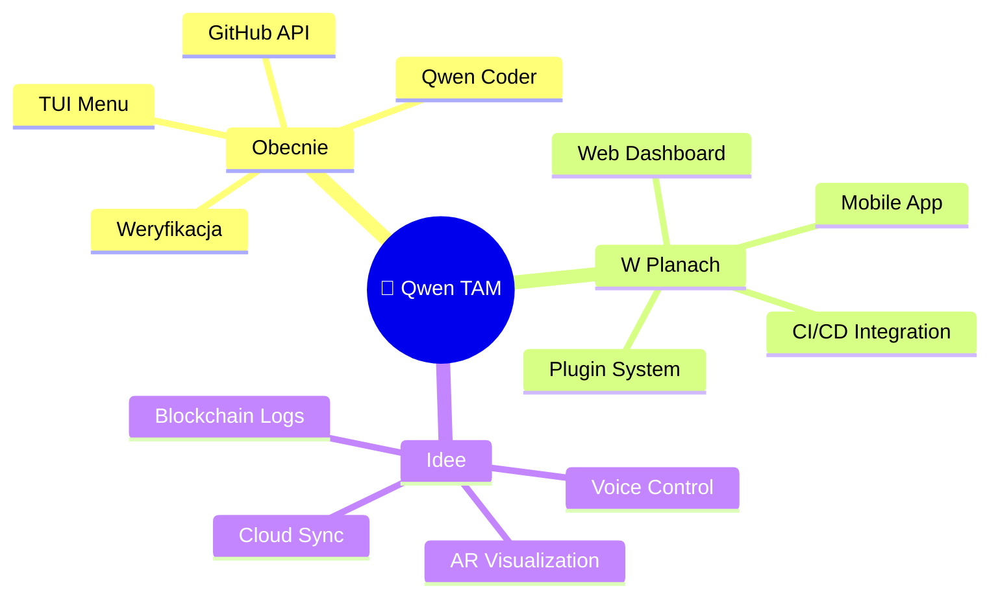
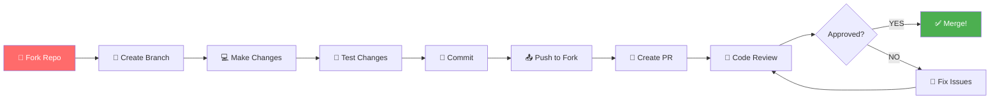

# 🚀 Qwen Time & Automation Manager

<div align="center">


**Kompleksowe narzędzie do zarządzania czasem i automatyzacji z AI**

⭐ Jeśli podoba Ci się ten projekt, daj gwiazdkę! ⭐

</div>

---

## 🎨 Spis Treści

- [🌟 Opis Projektu](#-opis-projektu)
- [⚡ Szybki Start](#-szybki-start)
- [🏗️ Architektura Systemu](#️-architektura-systemu)
- [🔥 Główne Funkcjonalności](#-główne-funkcjonalności)
- [🛠️ Technologie](#️-technologie)
- [📊 Przykłady Użycia](#-przykłady-użycia)
- [📁 Struktura Projektu](#-struktura-projektu)
- [🤝 Contributing](#-contributing)
- [📄 Licencja](#-licencja)

---

## 🌟 Opis Projektu

```
╔═══════════════════════════════════════════════════════════╗
║                                                           ║
║   👋 Witaj w Qwen TAM - Twoim Asystencie AI!             ║
║                                                           ║
║   🤖 Lokalne modele Qwen Agent + Qwen Coder              ║
║   📝 Zarządzanie zadaniami i czasem                      ║
║   🔗 Integracja z GitHub API                             ║
║   💻 Generowanie kodu w Bash, C++, C#, WebUI, Android    ║
║                                                           ║
╚═══════════════════════════════════════════════════════════╝
```

**Qwen Time & Automation Manager** to zaawansowana aplikacja TUI (Text User Interface) działająca w terminalu, która revolutionizuje sposób pracy developerów na Raspberry Pi 4!

### ✨ Co potrafi Qwen TAM?

| Funkcja | Opis | Status |
|---------|------|--------|
| 🎯 **Zarządzanie Zadaniami** | Planowanie, śledzenie i organizacja zadań | ✅ Gotowe |
| 🤖 **AI Code Generation** | Generowanie kodu z Qwen Coder | ✅ Gotowe |
| 🔐 **GitHub Integration** | Tworzenie repozytoriów, commit, push | ✅ Gotowe |
| 🧪 **Code Verification** | Statyczna analiza i testy jednostkowe | ✅ Gotowe |
| 🔄 **Workflow Automation** | Automatyzacja wieloetapowych procesów | ✅ Gotowe |
| 📱 **Multi-Platform** | Bash, C++, C#, WebUI, Android | ✅ Gotowe |

---

## ⚡ Szybki Start

### 📦 Instalacja w 3 Krokach

```bash
# 📥 Krok 1: Pobierz repozytorium
git clone <URL_REPOZYTORIUM>
cd qwen-tam

# 🔧 Krok 2: Uruchom instalację (wymaga root)
sudo ./install.sh

# 🎉 Krok 3: Gotowe! Uruchom aplikację
qwen-tam
```

### 🎛️ Opcje Instalacji

```
┌─────────────────────────────────────────────────────────┐
│  🛠️  OPCJE SKRYPTU INSTALACYJNEGO                      │
├─────────────────────────────────────────────────────────┤
│  sudo ./install.sh          → Instalacja standardowa   │
│  sudo ./install.sh --force  → Instalacja bez pytań     │
│  sudo ./install.sh --check  → Sprawdź wymagania        │
│  sudo ./install.sh --uninstall → Odinstaluj aplikację  │
└─────────────────────────────────────────────────────────┘
```

### ⚙️ Pierwsza Konfiguracja



---

## 🏗️ Architektura Systemu

### 📊 Diagram Przepływu Danych



### 🔄 Workflow Cykl Życia Projektu



---

## 🔥 Główne Funkcjonalności

### 🎯 0. Zarządzanie Konfiguracją

```
┌──────────────────────────────────────────────────────┐
│  ⚙️  CONFIGURATION & SETTINGS                       │
├──────────────────────────────────────────────────────┤
│  [0.1] 📝 View Current Configuration                │
│  [0.2] 🔑 Manage GitHub Token                       │
│  [0.3] 👥 User Profiles Management                  │
│  [0.4] 🎨 Theme & Appearance                        │
│  [0.5] 🔙 Back to Main Menu                         │
└──────────────────────────────────────────────────────┘
```

**Funkcje:**
- 🔐 Bezpieczne zapisywanie tokena w `~/.qwen_tam_config`
- 👥 Obsługa wielu profili użytkownika
- 🎨 Motywy kolorystyczne TUI

---

### 🚀 1. Tworzenie Repozytoriów GitHub



**Możliwości:**
- ✨ Tworzenie repozytoriów przez GitHub API
- 🌍 Wsparcie dla public/private
- 📦 Automatyczna inicjalizacja Git
- 📝 Pierwsze commity

---

### 💻 2. Generowanie Treści z Qwen Coder

```
╔═══════════════════════════════════════════════════════════╗
║         🤖 QWEN CODER - GENERATOR KODU                   ║
╠═══════════════════════════════════════════════════════════╣
║                                                           ║
║  [2.1] 📁 Create/Update Project Structure                ║
║  [2.2] 🐍 Create/Update Shell Script                     ║
║  [2.3] 💻 Create/Update C/C#/C++ Code with GUI           ║
║  [2.4] 🌐 Create/Update WebUI Script                     ║
║  [2.5] 📱 Create/Update Android App                      ║
║  [2.6] ✏️  Edit Existing File with AI                    ║
║                                                           ║
╚═══════════════════════════════════════════════════════════╝
```

#### 📊 Obsługiwane Technologie

| Typ | Języki | Frameworki | Platformy |
|-----|--------|------------|-----------|
| 🐍 **Bash** | Bash 4.0+ | ncurses, dialog | Linux |
| 💻 **Desktop GUI** | C++, C# | Qt, .NET MAUI, Avalonia, GTK | Linux, Windows, macOS |
| 🌐 **WebUI** | Go, Node.js, C# | Apache2 + Reverse Proxy | Linux |
| 📱 **Android** | Kotlin, Java, Dart, C# | Native, Flutter, .NET MAUI | Android |
| 🔌 **Backend API** | Go, C++, C# | gRPC, REST, NATS, MQTT | All |

---

### 🧪 3. Weryfikacja Kodu



**Proces weryfikacji:**
- 🔎 Statyczna analiza kodu
- 🔨 Uruchamianie kompilatora
- 🧪 Wykonanie testów jednostkowych
- 📊 Generowanie raportu jakości

---

### 🤖 4. Automatyzacja z Qwen Agent

```
┌─────────────────────────────────────────────────────────┐
│  🤖 QWEN AGENT - TRYBY PRACY                            │
├─────────────────────────────────────────────────────────┤
│                                                         │
│  🗣️  Interactive     - Dyskusja krok-po-kroku          │
│  🚀 Autonomous      - Pełna automatyzacja               │
│  👁️  Supervised      - Autonomiczny z zatwierdzaniem   │
│  📦 Batch           - Przetwarzanie wsadowe             │
│                                                         │
└─────────────────────────────────────────────────────────┘
```

**Funkcje Agenta:**
- 💬 Dyskusja AI w celu zrozumienia wymagań
- 📋 Planowanie wieloetapowych zadań
- ⚡ Obsługa zdarzeń (event handling)
- 📝 Szczegółowe logowanie (debug mode)

---

## 🛠️ Technologie

### ⚠️ ZASADA NADRZĘDNA: **NO PYTHON**

```
╔═══════════════════════════════════════════════════════════╗
║                                                           ║
║   ⛔ STROGA ZABRONIENIE: NO PYTHON! ⛔                   ║
║                                                           ║
║   W całym projekcie NIGDY nie używamy języka Python.     ║
║   Wszystkie komponenty muszą być w dozwolonych tech.     ║
║                                                           ║
╚═══════════════════════════════════════════════════════════╝
```

### 📊 Porównanie Technologii



### 📚 Szczegóły Technologii

#### 1. 🐍 Bash Shell Script
```yaml
Zastosowanie: 
  - Skrypty systemowe
  - Automatyzacja administracyjna
  - Narzędzia CLI i TUI
  
Środowisko: Linux (Debian/Raspbian, Ubuntu, Alpine)
Standard: POSIX sh lub Bash 4.0+
Flagi: set -euo pipefail
```

#### 2. 💻 C / C# / C++
```yaml
Zastosowanie:
  - Aplikacje desktopowe
  - Moduły obliczeniowe
  - Zaawansowane GUI/TUI

Frameworki:
  - C/C++: Qt, GTK, ncurses
  - C#: .NET MAUI, Avalonia, WPF
  
Platformy: Linux, Windows, macOS
```

#### 3. 🌐 WebUI
```yaml
Stack:
  Serwer: Apache2 (mod_proxy, mod_ssl)
  Backend: Go, Node.js, C#
  Frontend: HTML5, CSS3, JS (Vue/React/Alpine)
  
Architektura: Reverse Proxy → Backend API
```

#### 4. 📱 Android App
```yaml
Języki:
  - Native: Kotlin, Java
  - Cross-platform: Flutter (Dart), .NET MAUI (C#)
  
Komunikacja: REST API / gRPC
Funkcje: Offline mode, Push notifications
```

---

## 📊 Przykłady Użycia

### 🎬 Pełny Przykład Sesji

```bash
# ═══════════════════════════════════════════════════════ #
#  🚀 KROK 1: Inicjalizacja Projektu                     #
# ═══════════════════════════════════════════════════════ #

$ ./qwen-tam.sh --new-project

> Podaj nazwę projektu: time-tracker-desktop
> Wybierz technologię: 
  [1] Bash  [2] C++ Qt  [3] C# MAUI  [4] WebUI  [5] Android
> Wybór: 2
> Opis: Desktop app for tracking work time with SQLite storage

# ═══════════════════════════════════════════════════════ #
#  📁 KROK 2: Qwen Agent Tworzy Strukturę                #
# ═══════════════════════════════════════════════════════ #

✓ Created: time-tracker-desktop/
✓ Created: time-tracker-desktop/src/
✓ Created: time-tracker-desktop/include/
✓ Created: time-tracker-desktop/CMakeLists.txt
✓ Created: time-tracker-desktop/README.md

# ═══════════════════════════════════════════════════════ #
#  💻 KROK 3: Qwen Coder Generuje Kod                    #
# ═══════════════════════════════════════════════════════ #

✓ Generated: src/main.cpp (main entry point)
✓ Generated: src/mainwindow.cpp (GUI window)
✓ Generated: src/timemodel.cpp (business logic)
✓ Generated: include/mainwindow.h
✓ Generated: include/timemodel.h

# ═══════════════════════════════════════════════════════ #
#  🧪 KROK 4: Weryfikacja                                #
# ═══════════════════════════════════════════════════════ #

$ ./qwen-tam.sh --verify time-tracker-desktop

✓ Syntax check passed (g++ -std=c++17)
✓ Build successful (CMake + make)
✓ No Python imports detected 🎉
✓ Unit tests: 12/12 passed

# ═══════════════════════════════════════════════════════ #
#  📤 KROK 5: Commit i Push                              #
# ═══════════════════════════════════════════════════════ #

$ ./qwen-tam.sh --commit-push -m "Initial version"

✓ Git add completed
✓ Git commit: a3f8b2c
✓ Git push to origin/main
✓ Tag v0.1.0 created
```

### 📈 Wizualizacja Workflow

```mermaid
gantt
    title Harmonogram Generowania Projektu
    dateFormat X
    axisFormat %s
    
    section Struktura
    Planowanie       :0, 5
    Tworzenie katalogów :5, 10
    
    section Kod
    main.cpp         :10, 25
    mainwindow.cpp   :15, 30
    timemodel.cpp    :20, 35
    Header files     :25, 35
    
    section Weryfikacja
    Syntax check     :35, 40
    Build            :40, 50
    Tests            :45, 55
    
    section Deploy
    Git commit       :55, 60
    Git push         :60, 65
```



---

## 📁 Struktura Projektu

```
qwen-tam/
│
├── 📄 install.sh              # Skrypt instalacyjny
├── 📄 qwen-tam.sh             # Główny skrypt TUI
├── 📄 README.md               # Dokumentacja (ten plik!)
├── 📄 LICENSE                 # Licencja MIT
├── 📄 SECURITY_IMPROVEMENTS.md # Bezpieczeństwo
│
├── 📁 scripts/
│   ├── 🔧 setup-utils.sh      # Narzędzia konfiguracyjne
│   ├── 🤖 ai-integration.sh   # Integracja z AI
│   └── 🧪 validators.sh       # Walidatory kodu
│
├── 📁 logs/
│   ├── 📝 agent.log           # Logi Qwen Agent
│   ├── 📝 coder.log           # Logi Qwen Coder
│   ├── 📝 verify.log          # Logi weryfikacji
│   └── 📝 git.log             # Operacje Git
│
└── 📁 finish/
    └── 🏁 completion-scripts  # Skrypty finalizujące
```

---

## 🎯 Roadmap



---

## 🤝 Contributing

Chcesz przyczynić się do rozwoju projektu? 

```
╔═══════════════════════════════════════════════════════════╗
║           🌟 JAK MOŻESZ POMÓC? 🌟                        ║
╠═══════════════════════════════════════════════════════════╣
║                                                           ║
║   🐛  Znajdź bug → Zgłoś Issue                           ║
║   💡  Masz pomysł → Dyskutuj na Issues                   ║
║   💻  Umiesz kodować → Stwórz Pull Request               ║
║   📝  Lubisz pisać → Popraw dokumentację                 ║
║   📢  Chcesz pomóc → Polecz projekt znajomym!            ║
║                                                           ║
╚═══════════════════════════════════════════════════════════╝
```

### Proces Contributing



---

## 📞 Kontakt i Wsparcie

<div align="center">

| 📧 | 🐛 | 💬 |
|----|----|----|
| [Email](mailto:contact@qwen-tam.dev) | [Issues](https://github.com/qwen-tam/issues) | [Discussions](https://github.com/qwen-tam/discussions) |

</div>

---

## 📄 Licencja

```
╔═══════════════════════════════════════════════════════════╗
║                                                           ║
║   📜 MIT License                                          ║
║                                                           ║
║   Copyright (c) 2025 Qwen TAM Contributors               ║
║                                                           ║
║   Możesz używać, modyfikować i rozpowszechniać            ║
║   ten software bez ograniczeń!                           ║
║                                                           ║
╚═══════════════════════════════════════════════════════════╝
```

---

## 🙏 Podziękowania

<div align="center">

**Stworzone z ❤️ dla developerów Raspberry Pi 4**

```
   _______________
  | _____________ |
  | |           | |
  | |  Qwen TAM | |
  | |___________| |
  |_______________|
      |_______|
      |_______|
      |_______|
      |_______|
      |_______|
     /_________\
    /___________\
   /_____________\
  
  🎉 Dziękujemy za korzystanie! 🎉
```

**© 2025 Qwen TAM Contributors** | Zbudowane z 🍓 dla społeczności

</div>
